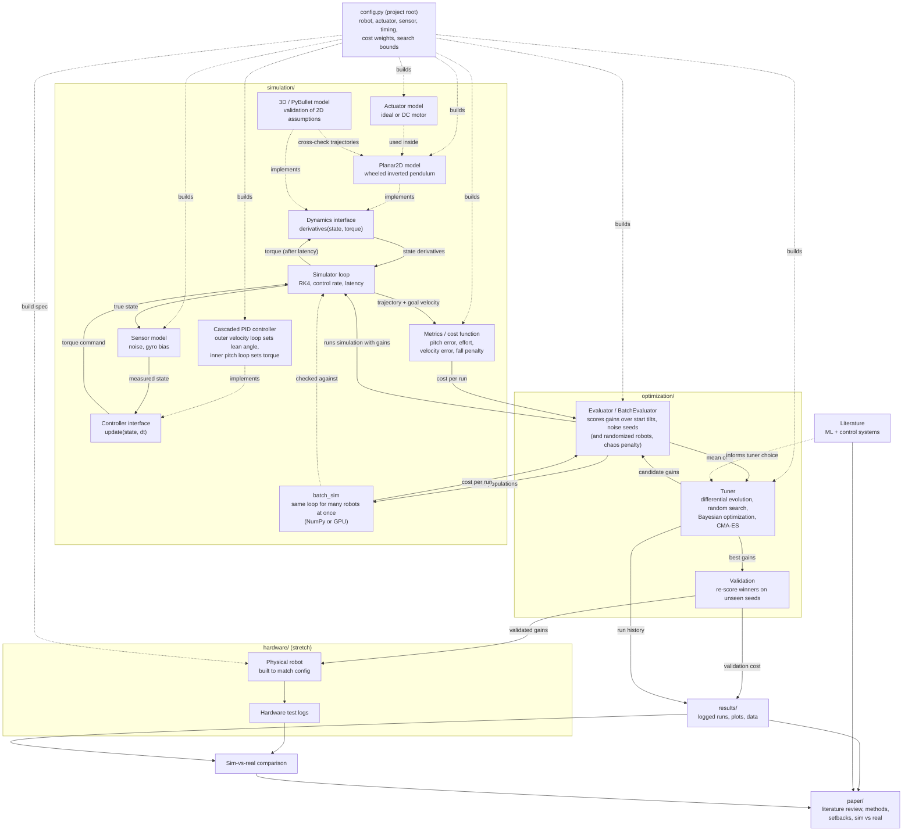

# Project Architecture: ML-Tuned Control of a Two-Wheeled Balancing Robot

Living document. Updated as components are designed and built.
Last updated: 2026-09-28

See also:
- `README.md` — the folder layout, and the exact order everything runs in.
- `config.py` (project root) — the single place to edit the robot, actuator model, sensor noise, delays, cost weights, search ranges, and the batched tuner's robustness test.
- `simulation/CONDITIONS.md` — the running list of real-world effects the simulation includes.
- `BATCHED.md` — the batched (NumPy/GPU) engine: design, verification, speed.
- `archive/CHANGES_FROM_ORIGINAL.md` — what was corrected from the first version of the code.

## Status legend

- **Planned**: designed on paper, no code yet
- **In progress**: code being written
- **Built**: working and tested
- **Stretch**: may not fit within the course timeline

## System flowchart

## Component status

| Component | Location | Status |
|---|---|---|
| Project configuration (single source of truth) | config.py | Built |
| Robot config (parameters) | simulation/balance_sim/params.py | Built |
| Dynamics interface | simulation/balance_sim/dynamics.py | Built |
| Planar2D model | simulation/balance_sim/planar2d.py | Built |
| Actuator model (ideal, DC motor) | simulation/balance_sim/actuators.py | Built |
| Sensor model (noise, gyro bias) | simulation/balance_sim/sensors.py | Built |
| 3D / PyBullet validation model | simulation/ | Planned |
| Controller interface | simulation/balance_sim/controllers.py | Built |
| Pitch PID controller | simulation/balance_sim/controllers.py | Built |
| Cascaded velocity + pitch controller | simulation/balance_sim/controllers.py | Built (P outer loop: kv_i dropped after it always tuned to 0; no position hold yet) |
| Goal velocity profiles | simulation/balance_sim/controllers.py | Built (constant, step profile) |
| Simulator loop | simulation/balance_sim/simulator.py | Built (RK4, control-rate hold, latency, sensor hookup, goal recording) |
| Metrics / cost function | simulation/balance_sim/metrics.py | Built (weights now set via config.py) |
| Batched simulator (NumPy + PyTorch/CUDA graphs) | simulation/batch_sim/ | Built (bit-identical to the reference in float64 on NumPy) |
| Simulation tests | simulation/tests/ | Built (reference + batched) |
| Conditions list | simulation/CONDITIONS.md | Living document |
| Search space (gain bounds, log scaling) | optimization/tuning/search_space.py | Built |
| Evaluator (multi-scenario scoring) | optimization/tuning/evaluation.py | Built |
| Tuner: differential evolution | optimization/tuning/optimizers.py | Built |
| Tuner: random-search baseline | optimization/tuning/optimizers.py | Built |
| Tuner: Bayesian optimization | optimization/tuning/optimizers.py | Built (needs `pip install scikit-optimize`) |
| Result logging (JSON, CSV, plots) | optimization/tuning/reporting.py, run_tuning.py, run_batch_tuning.py | Built |
| Batched tuner: evaluator, vectorized DE, random search, CMA-ES | optimization/batch_tuning/, run_batch_tuning.py | Built |
| Robust scoring: 50 seeds, randomized robots, chaos penalty | optimization/batch_tuning/robust.py, config.py (`RobustnessSettings`) | Built |
| Benchmarks | optimization/benchmark.py, benchmark_batch.py | Built |
| Tuner + config tests | optimization/tests/ | Built (166 tests in total with simulation/tests) |
| Config snapshot saved with every run | config.py (`snapshot()`), both run scripts | Built |
| Reinforcement learning | optimization/ | Planned |
| Literature review | literature/, paper/ | Planned |
| Physical robot | hardware/ | Stretch |
| Sim-vs-real comparison | results/, paper/ | Stretch |

## How the pieces work together

(`README.md` has the step-by-step version, including the batched engine.)

1. **`config.py`** at the project root holds every adjustable number: the robot's physical parameters, which actuator model to use, sensor noise, latency and timing, the controller's lean-angle cap and hand-tuned baseline gains, the cost function's weights, the tuner's test scenario (goal velocity profile, start tilts, noise seeds), and the search bounds for each gain. It builds the real objects (`RobotParams`, `Planar2D`, `EvalConfig`, `SearchSpace`, ...) that the rest of the code uses, so a single edit here reaches the simulation, the demos, and the tuner together.
2. The **simulator loop** advances the model in time. At each control tick, the **sensor model** turns the true state into a noisy measurement, the controller turns that into a torque command, and the command reaches the actuator after the configured latency.
3. The **cascaded controller** compares measured velocity to the **goal velocity**. The outer loop turns that error into a lean angle, and the inner pitch loop turns the lean-angle error into torque.
4. The **actuator model** converts the command into applied torque (ideal, or limited by back-EMF, supply voltage, and current). The dynamics model returns how the state changes.
5. **Metrics** turn a finished trajectory into a score: pitch error, control effort, velocity error against the goal, and a penalty for falling.
6. The **evaluator** takes a set of gains, runs several scenarios (different start tilts and noise seeds), and returns the mean cost.
7. The **tuner** proposes gains, reads the evaluator's score, and iterates. Differential evolution and Bayesian optimization are both available; random search is the baseline either has to beat.
8. The winning gains are re-scored on noise seeds the search never saw (**validation**) to check for overfitting. Runs are logged to **results/** and feed the **paper**, alongside the literature review.
9. If the hardware phase happens, the validated gains are loaded onto the **physical robot**, and the gap between simulated and measured behavior becomes a central result of the paper.

## Change log

- 2026-09-18: Initial version. All components planned.
- 2026-09-18: Simulation core built and tested (params, dynamics interface, Planar2D, PID, simulator loop, metrics). Added Planar2D.critical_pitch_gain(), the analytic lower bound on Kp, for use as a tuner search bound.
- 2026-09-18: Added sensor noise, control latency, and a DC motor model. Added CONDITIONS.md to track real-world effects. Tests now 25.
- 2026-09-19: Added cascaded velocity/pitch controller, goal velocity profiles, and a velocity error term in the cost function. Tests now 38.
- 2026-09-21: Built the first tuner (optimization/tuning): search space, multi-scenario evaluator, differential evolution, random-search baseline, validation on unseen seeds, and result logging. Sped up the simulation core about 2.5x (plain-float math in the hot path) so tuning runs finish in minutes. Tuner tests: 14.
- 2026-09-24: Added config.py at the project root as the single source of truth for physical parameters, actuator model, sensor noise, timing, cost weights, and search bounds; the demos and the tuner now all build from it instead of each holding their own copies of these values (this fixed a couple of small inconsistencies, like two different demo scripts using two different latency values). Added Bayesian optimization (scikit-optimize) as a second search method alongside differential evolution. Tuner + config tests: 23.
- 2026-09-28: Every tuning run now records a full snapshot of config.py (all robot parameters, actuator and sensor settings, timing, limits, cost weights, scenario, search bounds, plus derived values) in comparison.json and in each method's own result file, along with the run arguments and a timestamp. Tests: 25.
- 2026-09-28: Created CPU/, a corrected copy of simulation/, optimization/, and config.py that serves as the reference for the GPU rewrite (originals untouched; details in CPU/README.md). Fixes: the DC motor now respects max_torque; both controller loops have anti-windup; the cost's pitch term is measured against the commanded lean (switchable back to upright); every start tilt is tried with every seed (9 training runs, 30 validation); run_tuning.py adds an equal-budget comparison and bound warnings for every method; one requirements.txt; added optimization/benchmark.py. Tests: 86.
- 2026-09-28: Built the batched engine (then GPU/): batch_sim steps many robots at once with NumPy or PyTorch on the GPU (CUDA graphs), matching the reference simulator exactly in float64 on NumPy; batch_tuning adds a batched evaluator, vectorized differential evolution, and CMA-ES; robust scoring adds 50 seeds, randomized robots, and a chaos penalty. Up to about 5,800x faster per simulation than the reference on the GPU.
- 2026-09-28: Cleanup. The corrected code (CPU/) is now the project's only simulation/, optimization/ and config.py, with the batched engine alongside it (simulation/batch_sim, optimization/batch_tuning, run_batch_tuning.py, benchmark_batch.py). The robustness settings moved into config.py. One pytest.ini, one requirements.txt, one results/ (tuning/, batch_tuning/, benchmarks/). The original code and its results moved to archive/original/. Added README.md describing the run order. Tests: 153.
- 2026-09-28: Every project value now lives only in config.py: RobotParams, MotorParams, EvalConfig, SimSpec, BatchRobot, cost() and the search space lost their duplicate defaults, SensorNoise.typical() was removed, and the controllers' integral limits (previously hardcoded in two places) moved into ControllerConfig. The tests build from CONFIG. Dropped kv_i: the project's gain set is [kp, ki, kd, kv_p] (the controllers and both simulators still accept a fifth gain). The two tuning scripts share their results table, bound check and summary figure (tuning/reporting.py, SearchSpace.at_bounds), and the batched evaluator's noise_for / simulations_per_evaluation are public. The hand-tuned baseline without kv_i scores 0.243 (reference validation) instead of 0.277; the tuned optimum is unchanged at 0.108. Tests: 166.
- 2026-09-30: Added simulation/animate.py, an optional viewer: an animated side view of one or more runs (wheel, body, center of mass, commanded lean) with pitch / velocity / torque plots, saved as GIF or MP4 if wanted. Runs are simulated with the reference simulator first and then played back, or replayed from trajectory CSVs (balance_sim.save_trajectory / load_trajectory). Both tuning scripts now save their example runs to <results>/trajectories/. Tests: 172.
