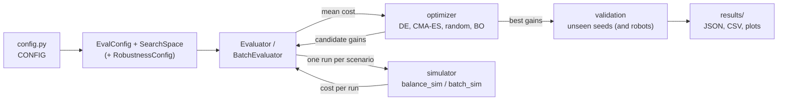

# ML-tuned balancing robot: how the code fits together

One config, one simulator (with a batched version of it), one tuner (with a batched version of it), one results folder.

```
config.py                  every adjustable number (robot, motor, sensor, timing, cost, scenario, search bounds, robustness)
simulation/
  balance_sim/             reference simulator: one robot at a time, readable, the source of truth
  batch_sim/               the same simulator stepping many robots at once (NumPy on the CPU, or PyTorch on the GPU)
  examples/                demo runs with plots; physics_checks.py reproduces every number in PHYSICS.md
  animate.py               watch runs: animated side view + live plots, simulated or replayed from CSV
  tests/                   balance_sim tests; batch_sim checked against balance_sim
  CONDITIONS.md            which real-world effects are modeled
optimization/
  tuning/                  reference tuner: search space, Evaluator, random search / DE / Bayesian optimization
  batch_tuning/            batched tuner: BatchEvaluator, random search / DE / CMA-ES, robust scoring
  run_tuning.py            tune with the reference code
  run_batch_tuning.py      tune with the batched code (robust scoring, NumPy or GPU)
  benchmark.py             speed of the reference code
  benchmark_batch.py       speed of the batched code
  tests/                   tuner and config tests
results/
  tuning/                  run_tuning.py output
  batch_tuning/            run_batch_tuning.py output
  benchmarks/              both benchmarks
archive/                   the superseded original code and its results (unused)
```

More detail: `ARCHITECTURE.md` (design, status, change log), `BATCHED.md` (the batched/GPU engine, its verification and speed), `PHYSICS.md` (derivation of every equation in the simulator, its limits, and what to improve), `simulation/CONDITIONS.md`.

## Side project: pivot robot

An offshoot that adds a servo-driven pivot on top of the robot with a second body piece on it (a third degree of freedom and a second actuator). It lives next to the main system and changes none of it: it reuses `balance_sim`'s motor, sensor, cascaded PID and cost code, and `tuning`'s search methods, by calling them. Shared values (wheels, motors, noise, timing, scenario, cost weights) come from `config.py`; only the new ones are in `pivot_config.py`.

```
pivot_config.py                         body split, servo, pivot sensor, pivot gains, LQR weights, extra search bounds
simulation/pivot_sim/                   3-DOF model, servo, simulator, cascaded PID + pivot loop, LQR, cost, plots
simulation/examples/run_pivot_demo.py   held vs level vs LQR vs tuned, plotted or animated
simulation/tests/test_pivot.py          its tests (run with the rest by python -m pytest)
optimization/pivot_tuning/              PivotEvaluator for the existing search methods
optimization/run_pivot_tuning.py        tune its 7 gains; output in results/pivot_tuning/
```

```
python simulation/examples/run_pivot_demo.py --animate
python optimization/run_pivot_tuning.py --workers -1 --compare-held
```

Details (derivation, servo model, controllers, results so far): `PIVOT.md`.

## What runs, in order



### 1. Setup (once per script)

1. The script adds the project folder to Python's path and runs `from config import CONFIG`. Importing `config.py` also puts `simulation/` and `optimization/` on the path, which is how every package finds the others.
2. `CONFIG` turns its settings into the objects the code uses:
   - `build_eval_config()` gives an `EvalConfig`: robot and motor parameters, sensor noise, timing, the goal-velocity profile, start tilts, noise seeds and cost weights.
   - `build_search_space()` gives the gain bounds. The lowest Kp is set from `Planar2D.critical_pitch_gain()`, the minimum that can hold this robot up at all.
   - `build_robustness()` (batched tuner only) gives the robustness test: 50 seeds, robot randomization spreads, and the chaos-penalty settings.
3. The evaluator is built from those:
   - **Reference:** `Evaluator` (`tuning/evaluation.py`).
   - **Batched:** `BatchEvaluator` (`batch_tuning/evaluation.py`). It also works out, once, everything that's the same for every run:
     - a `Schedule`: which controller command reaches the motor at each step (the latency), and the goal velocity at each step;
     - one sensor-noise table per seed, drawn exactly as `SensorNoise` would;
     - one randomized robot per scenario, plus a twin of each scenario with its start tilt nudged, for the chaos penalty.

### 2. The search loop (repeats until the budget runs out)

4. The **optimizer** proposes gains as points in the unit cube. `SearchSpace.decode` turns them into real gains `[kp, ki, kd, kv_p]` (Kp on a log scale). The outer velocity loop is proportional only: its integral gain `kv_i` always tuned to 0, so it isn't searched. The controllers still accept a fifth gain if it's ever needed.
   - Reference optimizers ask for one candidate at a time.
   - Batched optimizers hand over a whole generation.
5. The **evaluator** makes one run per scenario, where a scenario is every start tilt paired with every noise seed.
   - **Reference:** each run is its own `simulate()` call.
   - **Batched:** it builds one big batch of candidates × scenarios (× twins) and passes it in chunks to `simulate_batch` (NumPy) or `TorchSimulator.run` (GPU).
6. **One simulation** covers 6 s at a 2.5 ms physics step (2,400 steps) with a 5 ms controller (1,200 ticks). Each physics step does this, in order:
   1. *On a controller tick only:*
      - The **sensor** adds noise and gyro bias to the true state (`SensorNoise.measure`).
      - The **controller** (`CascadedPIDController.update`) runs its two loops:
        - Outer loop: velocity error → commanded lean angle, capped at the max lean.
        - Inner loop: pitch error → torque command, capped at the torque limit.
        - Both integrators have anti-windup.
      - The command joins the **latency** queue.
   2. The command whose 10 ms delay has passed becomes the torque the **actuator** receives. It's held until the next one arrives.
   3. The **cost terms** for this step are added: pitch error from the commanded lean, torque², and velocity error from the goal.
   4. An **RK4 step** calls `Planar2D.derivatives` four times. Each call asks the **actuator** (`DCMotorActuator`: back-EMF, supply voltage, current limit) what torque is actually delivered, then solves the equations of motion.
   5. **Fall check:** past 60° of tilt the robot has fallen. The reference loop stops; the batched loop freezes that robot and keeps going with the rest.
7. Each run's **cost** is: pitch error + 0.01 × effort + velocity error, plus a fall penalty of 100 × (1 + the fraction of the run left).
   - **Reference:** `metrics.cost` computes it from the recorded trajectory.
   - **Batched:** the terms are summed during the run instead.
8. The evaluator averages the costs over scenarios and returns the result to the optimizer.
   - **Batched robust mode:** it adds `1.0 × mean |cost − twin's cost|`, the chaos penalty.
   - The optimizer uses the scores to propose the next gains, and steps 4–8 repeat.

### 3. Wrap-up

9. **Validation:** the best gains from each method, plus the hand-tuned baseline, are re-scored on noise seeds the search never saw. The batched tuner always does this in float64 with NumPy, both the reference way and the robust way (100 unseen seeds with unseen robots).
10. **Saved to `results/`:**
    - a JSON summary and a CSV history per method;
    - `comparison.json`, which includes a full snapshot of `config.py`;
    - `tuning_summary.png`: convergence, plus velocity, pitch and torque on an unseen seed;
    - `trajectories/*.csv`: those example runs, step by step, for `simulation/animate.py` to replay;
    - batched robust runs also save `robustness_summary.png`.
11. **Optional viewing:** `simulation/animate.py` animates runs after the fact. It never runs during tuning. It either replays a results folder's `trajectories/` CSVs or re-simulates gains with the reference simulator, then plays the recorded trajectory.

### How the two engines relate

- `batch_sim` uses the same equations as `balance_sim`, in the same order of operations.
  - In float64 its NumPy backend reproduces `balance_sim` trajectories bit for bit.
  - The GPU backend matches to about 1e-9 for well-behaved gains. Chaotic gains can't be reproduced exactly by any version (see `BATCHED.md`).
  - The tests check all of this.
- The batched tuner reuses the reference tuner's `EvalConfig`, `SearchSpace`, `TuningResult`, and its reporting (`save_result`, the results-table helpers and the summary figure in `tuning/reporting.py`). Its plots use the reference simulator for the example runs.
- **So:** `balance_sim`/`tuning` define what is correct, and `batch_sim`/`batch_tuning` do the same thing faster, at scale.

## Commands

From the project folder, with `C:\venvs\balancebot` active:

```
python -m pytest                                                     # every test (196, 24 of them the pivot side project), ~1.5 min
python simulation/examples/run_velocity_demo.py                      # one run, plotted
python simulation/animate.py                                         # animate hand-tuned vs the latest tuning result
python simulation/animate.py --gains 1.03 0.2 0.1 0.33 --speed 0.5   # any gains, slow motion
python simulation/animate.py --save robot.gif                        # save instead of showing
python optimization/run_tuning.py --workers -1 --bayesian            # reference tuner
python optimization/run_batch_tuning.py --backend torch --float32    # batched robust tuner on the GPU, ~70 s
python optimization/benchmark.py                                     # reference speed baseline
python optimization/benchmark_batch.py --backend torch --float32     # batched speed
```

Change the robot, the scenario, the cost or the robustness test in `config.py`, not in the scripts. It's the only place those values are written: the classes it builds (`RobotParams`, `MotorParams`, `EvalConfig`, `SimSpec`, the search space) have no defaults for them, and the tests build from `CONFIG` too.
